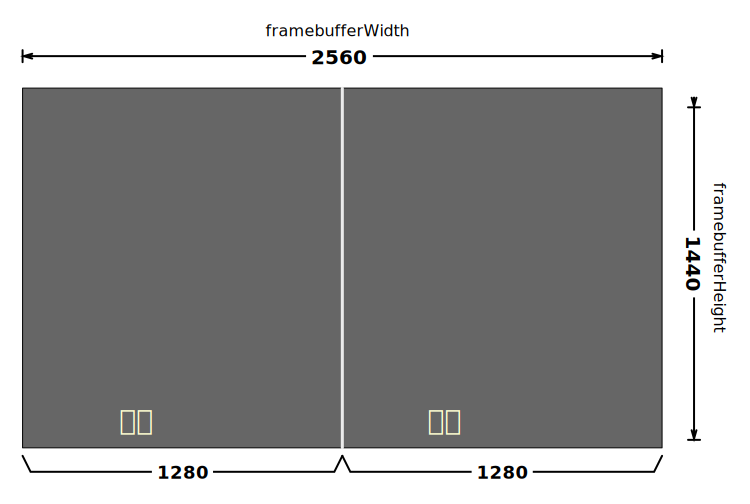

{{DefaultAPISidebar("WebXR Device API")}}

WebXRは、 [WebXR 機器 API](/ja/docs/Web/API/WebXR_Device_API) を中核として、拡張現実と仮想現実（AR および VR）の両方をウェブ上で実現するために必要な機能を提供します。これらの技術を合わせて、**複合現実 (MR)** または**クロス現実 (XR)** と呼びます。複合現実は大規模で複雑なテーマであり、学ぶべきことが多く、また、ユーザーにとって魅力的な体験を生み出すために他の多くの API をまとめる必要があります。

このガイドでは、 WebXR とは何か、どのように動作するかの概要と、ウェブ向けの拡張現実や仮想現実の体験の開発を始めるために必要な予備的な基礎知識を提供します。

## WebXR とは何であり、何でないのか

WebXR は、ウェブコンテンツやアプリが、 VR ヘッドセットや AR ヘッドセットやメガネなどの複合現実ハードウェアとインターフェイスするために使用する API です。これには、三次元体験をシミュレートするために必要なビューのレンダリングプロセスの管理と、ヘッドセット（またはその他のモーションセンシング機器）の動きを感知して、ユーザーに表示する画像を更新するために必要なデータを提供する機能の両方が含まれます。

WebXR はさらに、携帯型 VR コントローラーや特殊な複合現実ゲームパッドなどの制御機器からの入力を受け入れるための対応も行っています。

WebXR はレンダリング技術ではないので、三次元データを管理したり、ディスプレイにレンダリングしたりする機能は提供しません。これは重要な事実として覚えておいてください。 WebXR はシーンを描画する際に関連するタイミングやスケジューリング、さまざまな視点を管理しますが、モデルをロードして管理する方法や、レンダリングしてテクスチャを貼る方法などはわかりません。その部分は完全にあなた次第です。幸いなことに、 WebGL と WebGL ベースのさまざまなフレームワークとライブラリーが用意されており、これらすべてを簡単に扱うことができます。

### WebXR は WebVR とどう違うのか

WebVR は、仕様作成者がウェブ上で仮想現実 API を作成するための最適なアプローチを決定するために設計された実験的な API と見なされていました。ブラウザー実装者は WebVR のサポートをブラウザーに追加し、ウェブ開発者が実験を行えるようにしました。しかしすぐに、ウェブ上の仮想現実の API を完成させるには、 WebVR を「修正」しようとするよりも、新しい仕様を開始する方がより理にかなっていることが明らかになりました。

それが WebXR の誕生につながりました。根本的な違いは、 WebXR は仮想現実だけでなく、仮想オブジェクトとユーザーの周辺環境を融合させる拡張現実にも対応していることです。

もう一つの大きな違いは、 WebVR がコントローラーへの対応を[ゲームパッド API](/ja/docs/Web/API/Gamepad_API) に依存していたのに対し、 WebXR はほとんどの複合現実ヘッドセットで使用される高度な[入力コントローラー](/ja/docs/Web/API/WebXR_Device_API/Inputs)の対応を統合していることも大きな違いです。WebXR では、主な選択アクションとスクイーズアクションはイベントを使用して直接対応し、その他の制御は {{domxref("Gamepad")}} オブジェクトの WebXR 固有の特別な実装を介して利用することができます。

## 基本概念

XR のコードを開発する方法を学ぶ前に知っておくべき基本的な概念について考えてみましょう。

### 視野角

**視野角** (**FOV**) とは、昔のフィルムカメラから現代のデジタルビデオカメラ、さらにはコンピューターやモバイル機器のカメラに至るまで、あらゆる映像技術に適用される用語です。

#### 視野角とは？

視野とは、周囲を見ることができる範囲のことです。視野の幅は、度またはラジアン単位で指定され、視野の左端から右端までの円弧を定義する角度として測定されます。

人間の目は、約 135° の視野を取ることができます。健康な両目があると仮定すると、視野角は約 200° から 220° になります。なぜ、両眼で見ると視野が広くなるのに、単眼の 2 倍にはならないのでしょうか。それは、両眼の視野が大きく重なり合うからです。この重なりによって、奥行きを感じることができるのですが、その視野は約 115° です。重なり合った部分の外側では、単眼視に戻ります。

この図は、 FOV の概念を示すもので、左目は青い三角形、右目は赤い三角形です。薄茶色の重なり合った部分が両眼視で、奥行きを感じることができる部分です。よく見ると、それぞれの目が微妙に異なる形で物体を見ており、その 2 つが合成されて三次元の形状になっていることがわかります。

一般的に、アプリケーションは水平の視野角のみを定義し管理します。詳しくは、[レンダリングと WebXR フレームアニメーションコールバック](/ja/docs/Web/API/WebXR_Device_API/Rendering)のの[三次元の光学](/ja/docs/Web/API/WebXR_Device_API/Rendering#the_optics_of_3d)を参照してください。

#### 視野角と複合現実機器

ユーザーの目が仮想世界が完全に自分を取り囲んでいると錯覚するほど広い視野を実現するには、視野角が少なくとも両眼視領域の幅に近づく必要があります。基本的なヘッドセットは通常 90° 前後から始まり、最高のヘッドセットでは一般的に 150° 前後の視野を持ちます。視野角はレンズの大きさとユーザーの目との距離の問題であるため、ユーザーの眼球にレンズを装着せずに視野角を広げるには限界があります。

視野が広ければ、ユーザーの没入感を大幅に向上させることができます。しかし、視野角を広げると、その分、ヘッドセットの重量やコストが増加します。

### 自由度

**自由度** (degrees of freedom) という用語は、ユーザーが仮想世界内でどの程度自由に動けるかを示すものです。これは、 WebXR のハードウェア構成が、どれだけの種類の動きを認識し、仮想シーンに再現することができるかに直接関係しています。

**図: 3 軸の自由度を持つハードウェアで可能な動き（ヨー、ロール、ピッチ）を示した図**

#### 回転運動の自由度

最初の 3 つの自由度は **回転の自由度** です。回転の自由度は以下の通りです。

- ピッチ (pitch): 見上げる・見下ろす
- ヨー (yaw): 左右を向く
- ロール (roll): 左右に傾ける

これらのケースでは、ユーザーは空間の同じ場所に留まりながら、3つの軸のうちの1つまたは複数を回転させて、見ている方向を変えます。軸の自由度が2つのシステムは、ユーザーが左右や上下を見ることは感知できても、それ以外の動きを報告することはできません。

一般的なベースラインのヘッドセットは、 3 軸の自由度を持ち、 3 軸すべてで回転を認識します。これは、よく **3DoF** という略語で呼ばれます。

#### 平行移動の自由度

前後、左右、上下の 3 つの軸の自由度は、平行移動の自由度です。 6 つの自由度に対応していることを、 **6DoF** と呼びます。

より高度なヘッドセットでは、少なくとも平行運動の検出に最低限対応しているものもありますが、空間を通してより実質的な動きを捉えるには、通常、カメラ（可視光線または赤外線を使用）などの外部センサーが必要です。

### WebXR セッションモード

WebXR は、同じ API を使用して、 AR （拡張現実）セッションと VR （仮想現実）セッションの両方に対応しています。どちらの種類のセッションを作成するかは、セッションを作成するときに指定します。これは、作成したいセッションの種類に応じた適切なセッションモード文字列を指定することで行われます。

#### 仮想現実

VR 環境では、前景のオブジェクトから背景やスカイボックスまで、画像全体がアプリやサイトによってデジタル処理で作成されます。フレーム描画コードは、残像が発生する可能性を避けるために、各フレームで各ビューのすべてのピクセルを再描画する必要があります。プラットフォームによっては、以前にクリアされたフレームを提供する場合もありますが、フレームごとに各ピクセルを 2 回タッチする必要がないように、フレームバッファーを消去しないようにして、パフォーマンスを最適化する場合もあります。

WebXR では、2 つの VR セッションモードが利用可能です。**インライン**と**没入型**です。前者はセッションモード文字列 `inline` で指定され、ウェブブラウザーの文書のコンテキスト内でレンダリングシーンを表示し、表示するために特別な XR ハードウェアは必要ありません。没入型セッションモードは、セッションモード `immersive-vr` で示されます。このセッションモードは、ヘッドセットなどの XR 機器を必要とし、ユーザーのそれぞれの目に表示されるディスプレイを使用して、世界全体をレンダリングシーンで置き換えます。

#### 拡張現実

拡張現実 (AR) では、ユーザーは自分の周りの物理的な現実環境の上に表示されたレンダリングイメージを見ることになります。 AR は常に没入型の体験であり、シーンは（画面上の箱に囲まれているのではなく）ユーザーの周りの世界全体であるため、 AR セッションモードは `immersive-ar` のみです。

AR 機器には、基本的に 2 つの種類があります。

- カメラでユーザーの目の前の世界を撮影し、その画像の上に WebXR コンテンツを描画し、画面に画像を表示する機器です。端末の画面上に 2D で表示する携帯電話や、両眼のカメラでステレオ撮影し、奥行きを確保した上で、両眼の背景を撮影した WebXR シーンを描画するゴーグルなどがこれにあたります。
- 透明なメガネを使い、レンダリング画像を重ね合わせながら世界を見ることができる機器。ユーザーは、デジタル写真の羅列ではなく、現実の世界を直接見ることができます。

どちらの種類の機器も、 VR セッションを表示することが可能であるはずです。 WebXR は、一般に、使用する機器の種類を問いません。レンダリング処理は、各フレームをレンダリングする前に背景やスカイボックスを消去しないことを除いて、VRの場合とほとんど同じです。

## WebXR ハードウェアの種類

最もシンプルな XR の表現は、シーンをユーザーの画面に直接レンダリングするもので、ウェブ文書のコンテキスト内、または全画面モードのいずれかになります。これは、ユーザーが専用の XR 機器を持っていない場合や、電話などの携帯端末で AR や VR のアプリを閲覧している場合によく見られる方法です。

よりシンプルで低価格の XR 機器は、通常、内蔵コンピュータを使用するか、スマートフォンに接続し、基本的にモバイル CPU と GPU を使用してアプリを実行し、画像をレンダリングしてユーザーに表示します。より高性能なソリューションでは、アプリケーションの実行とグラフィック処理をデスクトップコンピューターなどの外部機器に任せて、ケーブルを使ってコンピューターに接続するか、無線ネットワークを使って画像を受信し、ユーザーに表示します。

### ヘッドセット

没入型 VR 体験の多くは、ゴーグルや何らかのヘッドセットを使って行われます。 VR ヘッドセットは頭に装着し、ストラップで頭の後ろを固定し、 1～2 台のディスプレイの画面をレンズで目に映します。それぞれの目に微妙に異なる画像を表示することで、奥行きを感じさせ、三次元を疑似体験することができます。

大半のヘッドセットでは、フレームが半分に分割された単一のディスプレイを使用し、その半分がユーザーのそれぞれの目に焦点を合わせています。例えば、ヘッドセットが 2560 x 1440 の画面を使用し、左半分が左目の表示に、右半分が右目の表示に使われる場合、フレームバッファーは次のように使用されます。

最も単純なヘッドセットは、統合されたセンサーを持たず、スクリーンの各半分を対応する目に焦点を合わせます。この代表的な例が [Google Cardboard](https://arvr.google.com/cardboard/)、 Google が最初に作ったヘッドセットの一種で、段ボールやその他の安価な材料を使って安価に作ることができます。これらの機器は、多くの場合、携帯電話をヘッドセットにはめ込み、その画面とオンボードのグラフィックプロセッサーを使用して、 XR シーンをレンダリングして表示することで動作します。

より高度なヘッドセットにはディスプレイが内蔵されており、ゴムやストラップ、またはマジックテープの留め具を使って頭に装着します。 これらのヘッドセットは、統合されたスピーカーとマイク、および/または外部のものを取り付けるためのコネクターを含む場合があります。さらに、これらのヘッドセットは、ヘッドセットが空間内を移動するときに検出するための様々なセンサーを有していてもよい。含まれるセンサーの型と数によって、ユーザーが持つ[自由度](#自由度)の数が決定されます。

### ゴーグルとメガネ

XR ゴーグルは、シミュレーションシーンの奥行きを再現するために必要なシーンのビューをレンダリングするために、グラフィック表示面を目の前に置くという点で、ヘッドセットと似ています。

しかし、ゴーグルは現実の世界を通過し、ユーザーの物理的な環境の上にレンダリングされた画像を重ね合わせるという違いがあります。これは、完全なヘッドセットで必要とされるような、世界をデジタルで再現することなく行われます。その代わり、ディスプレイの表面は透明で、何も表示していなければ、通常のメガネをかけているのと基本的に同じです。オブジェクトが描画されると、ゴーグルのレンズ上に描画され、その部分から物理的な環境が見えなくなります。

### CAVEs

**Cave Automated Virtual Environment** (**CAVE**) は没入型VR環境で、壁（場合によっては天井や床も）にシーンが投影または表示されるため、ユーザーはシミュレーションに完全に囲まれ、シーンに没入することができます。ユーザーは三次元メガネを着用し、投影された画像に三次元効果を加えるとともに、システムが前景のオブジェクトを世界にレンダリングするための手段を提供します。

ユーザーの行動は、ユーザーが身につけたり、手に持ったりするモーションセンサーや、最近では赤外線カメラで検知してモニターすることもあります。また、室内のあちこちに設置されたスピーカーからは、臨場感あふれるサウンドが聞こえてきます。

これらは、日常的に利用されるものではなく、実験的なもの、デモンストレーションのためのもの、あるいは大きな組織で利用されるものがほとんどです。欠点としては、 CAVE では壁より近いものをシミュレーションすることができないことです。

## 健康と安全に関する重要な注意事項

仮想の三次元の世界を作るという行為は、要するに、目が光を集める仕組みと、集めたデータを脳が解釈する仕組みを利用したものですから、ソフトウェア設計者や開発者は、その結果が正しいかどうか、いつも以上に注意する責任があることを心に留めておくことが大切です。

### VR 酔い

[VR 酔い](https://ja.wikipedia.org/wiki/VR酔い)とは、仮想現実を体験した人が、体験中や体験後しばらくの間、不快感や方向感覚の喪失、あるいは深刻な吐き気などを感じる症状のことです。

仮想現実の何が不快感や気持ち悪さを引き起こすのかについては、さまざまな説がありますが、その多くは、脳が考えていることと見ていることの間に微妙な違いがあっても、こうした症状を引き起こすという考え方に重点を置いています。

欠陥やズレ、歪みがあると、目と脳が混乱し、目の痛みや頭痛から、場合によってはめまいや激しい吐き気まで、さまざまな症状を引き起こす可能性があります。また、ヘッドセットの包括的な性質を考えると、発作を誘発する可能性のあるものを表示しないように注意することが重要です。ユーザーは、苦痛を与えるような画像を表示された場合、すぐに目をそらすことができないかもしれません。

### 物理的なリスク

没入型仮想現実のもう一つの潜在的な問題は、ユーザーがヘッドセットを装着したまま部屋の中を移動した場合、物理的な障害物に衝突してしまうことです。安全な環境でない限り、物理的な環境の中で安全だとわかっている空間をシミュレーションするなど、ユーザーの動きを制限する手がかりを提供することが重要です。

ユーザーのヘッドセットが機器につながれている場合、ユーザーがヘッドセットのコードを引っ張ったり引っ張ったりするような動きを促したり誘惑したりしないようにするのがよいでしょう。これは、怪我を引き起こすだけでなく、ユーザーのヘッドセットまたは機器（電話かコンピュータかにかかわらず）に大きな損傷を与える可能性があります。

どのようなユーザーにとっても危険な状況になる可能性があるコンテンツがある場合は、警告メッセージを表示する必要があります。同様に、可能であれば座ったままでいること、完全没入型バーチャルリアリティを体験する場合は、ヘッドセットを装着したまま動き回ることに注意するよう、ユーザーに注意を促すとよいでしょう。後悔するよりも、安全であることが一番です。

## フレームワークの役割

三次元グラフィック、特に複合現実には、複雑な数学、データ管理、その他の複雑なタスクが多く含まれるため、ほとんどの場合、シーンのレンダリングに WebGL を直接使用することはないでしょう。その代わりに、WebGL の上に構築されたフレームワークや ライブラリーを使用して、より便利に作業を行うことが多いでしょう。

WebGL API を直接使用するのではなく、フレームワークを使用することの利点は、ライブラリが仮想カメラ機能を実装している傾向があることです。OpenGL （およびその拡張である WebGL）はカメラビューを直接提供しませんが、代わりにカメラビューをシミュレーションするライブラリーを使用すれば、特に仮想世界を自由に移動できるコードを構築するときに、作業がずっとずっと楽になります。

[WebGL](/ja/docs/Web/API/WebGL_API) は、WebXR セッションに三次元の世界をレンダリングするために使用されるので、まず、WebGL の一般的な使用法と三次元グラフィックの基本についてよく理解しておく必要があります。

### 汎用三次元フレームワーク

これらのフレームワークは、汎用的なプログラミングや、ロジックを自分で作りたい場合のゲーム開発に向いています。三次元シーンの作成やアニメーションを、文脈に関係なく行うことができるように設計されています。

- [A-Frame](https://aframe.io/) （特に WebXR ベースのアプリを作成するために設計されています）
- [Babylon.js](https://www.babylonjs.com/)
- [Three.js](https://threejs.org/)

### ゲームのツールキット

ゲームのツールキットは、ゲーム開発者向けに設計されており、物理モデル、入力制御システム、アセット管理、三次元サウンド再生など、ゲームに特化した機能が含まれていることが多いです。

- [PlayCanvas](https://playcanvas.com/)

## 次のステップ

これらの基本情報が分かったら、複合現実の世界へ次のステップを踏み出す準備が整いました。以下の記事が参考になります。

- [WebXR アプリケーションのライフサイクル](/ja/docs/Web/API/WebXR_Device_API/Lifecycle)
- [WebXR セッションの起動と終了](/ja/docs/Web/API/WebXR_Device_API/Startup_and_shutdown)
- [移動、向き、動作: WebXR の例](/ja/docs/Web/API/WebXR_Device_API/Movement_and_motion)
